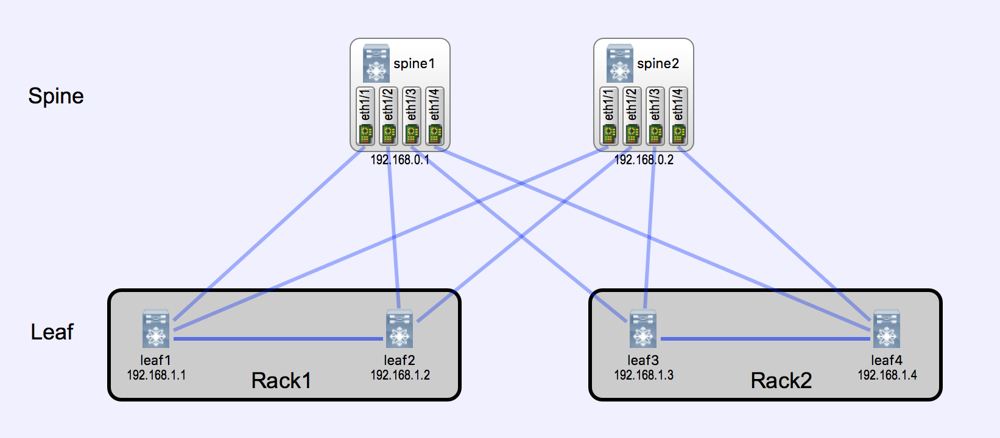
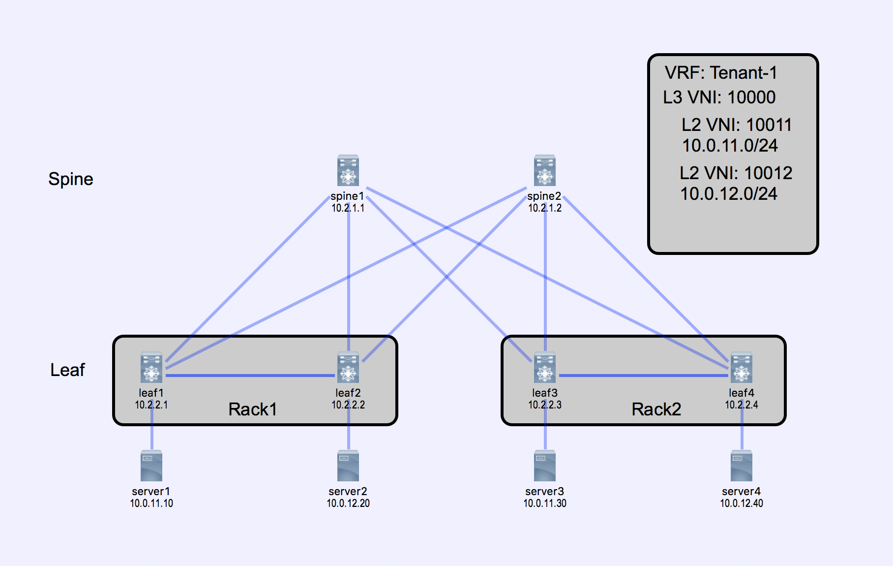

# spine-leaf

## Usage

This topology is designed to work with [virlutils](https://github.com/CiscoDevNet/virlutils)

`virl up virlfiles/spine-leaf`

## Topology




## Bonus

One of the most common configurations for this type of topology is VXLAN with EVPN
control plane.  If that's interesting to you we've added a fully configured version of the
topology [here](./full-evpn.virl) as well

To get started you can run the following:

```
git clone https://github.com/virlfiles/spine-leaf
cd spine-leaf
virl up -f full-evpn.virl
```

### IP Details


